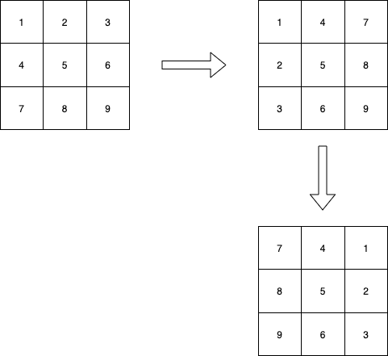

### 解题思路

- 先对角线变换
- 再竖直轴对称翻转

过程见图



### 代码

```go
func rotate(matrix [][]int) {
	row := len(matrix)
	if row <= 0 {
		return
	}

	column := len(matrix[0])
	// rotate by diagonal 对角线变换
	for i := 0; i < row; i++ {
		for j := i + 1; j < column; j++ {
			tmp := matrix[i][j]
			matrix[i][j] = matrix[j][i]
			matrix[j][i] = tmp
		}
	}
	// rotate by vertical centerline 竖直轴对称翻转
	halfColumn := column / 2
	for i := 0; i < row; i++ {
		for j := 0; j < halfColumn; j++ {
			tmp := matrix[i][j]
			matrix[i][j] = matrix[i][column-j-1]
			matrix[i][column-j-1] = tmp
		}
	}
}
```
