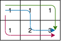
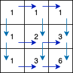
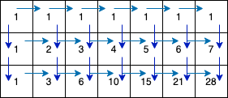

### 解题思路

- 为 3 x 2 时



- 为 3 x 3 时



- 为 7 x 3 时



> 注意： 只能向下或者向右移动一步

这题求小问题的数量，那么直接使用 `动态规划 dp`

那么特殊情况下，网格的`第一行`和`第一列`走法都是 `1种`

```go
	for i := 0; i < m; i++ { // special case first row
		dp[0][i] = 1
	}
	for i := 0; i < n; i++ { // special case first column
		dp[i][0] = 1
	}
```

`任意一点 dp[i][j]` 的走法是

```
dp[i][j] = dp[i-1][j] + dp[i][j-1]
```

最终获得到走法为 `dp[n-1][m-1]`

### 代码

```go
func uniquePaths(m int, n int) int {
	dp := make([][]int, n)
	for i := 0; i < n; i++ { // make matrix by m * n
		dp[i] = make([]int, m)
	}

	for i := 0; i < m; i++ { // special case first row
		dp[0][i] = 1
	}
	for i := 0; i < n; i++ { // special case first column
		dp[i][0] = 1
	}
	for i := 1; i < n; i++ { // cross frist
		for j := 1; j < m; j++ {
			dp[i][j] = dp[i-1][j] + dp[i][j-1]
		}
	}
	return dp[n-1][m-1]
}
```
