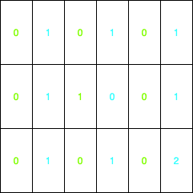
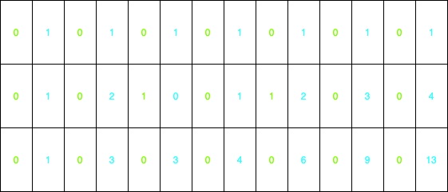

### 解题思路

此题为 62 题增强版

- 为 3 x 3 时 （绿色为标记，蓝色为路径数目）



- 为 7 x 3 时



> 注意： 只能向下或者向右移动一步

- 起点就是障碍物，那么这种情况直接输出 0

这题求最多的数量，那么直接使用 `动态规划 dp`

- 特殊情况下，网格的`第一行`和`第一列`走法都是 `1种`

按行列循环

  对网格内的内容为 0 就设置当前解为 1

绕开 `obstacleGrid[i][j]` 值为 1 的点

 `dp[i][j] = dp[i-1][j] + dp[i][j-1]`

最终获得到走法为 `dp[n-1][m-1]`

### 代码

```go
func uniquePathsWithObstacles(obstacleGrid [][]int) int {
	if len(obstacleGrid) == 0 || obstacleGrid[0][0] == 1 { // special case
		return 0
	}
	m, n := len(obstacleGrid), len(obstacleGrid[0])

	dp := make([][]int, m)
	for i := 0; i < m; i++ { // make DP matrix
		dp[i] = make([]int, n)
	}
	dp[0][0] = 1
	for i := 1; i < n; i++ { // scan column
		if dp[0][i-1] != 0 && obstacleGrid[0][i] != 1 {
			dp[0][i] = 1
		}
	}
	for i := 1; i < m; i++ { // scan row
		if dp[i-1][0] != 0 && obstacleGrid[i][0] != 1 {
			dp[i][0] = 1
		}
	}
	for i := 1; i < m; i++ {
		for j := 1; j < n; j++ {
			if obstacleGrid[i][j] != 1 { // pass obstacleGrid[i][j] == 1
				dp[i][j] = dp[i-1][j] + dp[i][j-1]
			}
		}
	}

	return dp[m-1][n-1]
}
```
